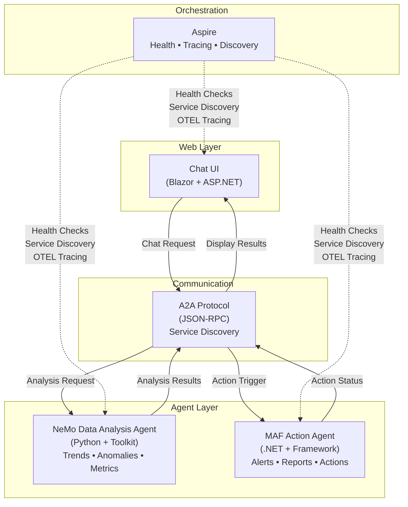

# MAF-A2A-NVIDIA-NemoAgents: Multi-Agent Data Analysis & Action System

> A production-ready sample demonstrating **NVIDIA NeMo Agent Toolkit** + **Microsoft Agent Framework (MAF)** with **Agent-to-Agent (A2A)** communication, orchestrated with **Aspire**.

## 🎯 The Scenario: Data Analysis Meets Action Execution

Modern enterprises need systems that can **analyze complex data in real-time and immediately take action** without manual handoffs.

This repository demonstrates a practical workflow:

1. **Data Analysis Agent (NeMo)**: Receives raw business data (sales metrics, system performance, anomalies)
2. **Analysis Results**: Detects trends, identifies anomalies, calculates KPIs using ML/statistics
3. **Action Orchestration**: Recommendations automatically flow to the Action Agent
4. **Action Agent (MAF)**: Executes remediation—sends alerts, generates reports, triggers escalations
5. **User Interface**: Chat-based interface for humans to request analysis and observe actions in real-time

### Why Two Agents?

- **Separation of Concerns**: Data analysis expertise ≠ action execution expertise
- **Scalability**: Agents can be deployed independently, scaled horizontally
- **Reliability**: Failure in one agent doesn't cascade; degraded mode still possible
- **Vendor Flexibility**: Mix and match toolkits (NeMo for analysis, MAF for orchestration)

---

## ⚡ Quick Start (3 Steps)

### Prerequisites

- **Python 3.10+** with pip
- **.NET 10 SDK** (download from <https://dotnet.microsoft.com/download>)
- **NVIDIA API key** for the NeMo agent
- **Azure OpenAI credentials** (`AZURE_OPENAI_ENDPOINT`, `AZURE_OPENAI_DEPLOYMENT_NAME`, `AZURE_OPENAI_API_KEY`) for the MAF/Web orchestration path
- **Aspire CLI** (optional, for orchestrated startup): <https://aspire.dev/get-started/install-cli/>

### Step 1: Clone

```bash
git clone https://github.com/yourusername/MAF-A2A-NVIDIA-NemoAgents.git
cd MAF-A2A-NVIDIA-NemoAgents
```

Configure Aspire-managed secrets before startup:

- **NeMo Agent**: `NVIDIA_API_KEY`
- **MAF/Web**: `AZURE_OPENAI_ENDPOINT`, `AZURE_OPENAI_DEPLOYMENT_NAME`, `AZURE_OPENAI_API_KEY`

If you are running without Aspire, use the manual setup flow in **[Manual Startup Guide](docs/MANUAL-STARTUP.md)**.

### Step 2: Install Dependencies

```bash
# Create and activate a local virtual environment
python -m venv .venv

# Windows PowerShell
.\.venv\Scripts\Activate.ps1
# Linux/macOS
source .venv/bin/activate

# Install Python dependencies for NeMo
pip install -r requirements.txt

# NeMo Toolkit CLI setup (required for running NeMo agent)
# Already included in requirements.txt above
```

### Step 3: Run the System

Using Aspire (recommended):

```bash
# Single command to start everything with orchestration
aspire start

# Open Aspire Dashboard at http://localhost:18888
# Click on each service to view logs and health
```

---

## 🏗️ System Architecture



### Key Integration Points

| Component | Role | Port | Technology |
|-----------|------|------|-----------|
| **NeMo Agent** | Data Analysis | 8088 | Python + NVIDIA NeMo Toolkit |
| **MAF Agent** | Action Execution | 5055 | .NET 10 + Microsoft Agent Framework |
| **Web UI** | User Interface | 5000 | Blazor + ASP.NET Core |
| **Aspire** | Orchestration | Dashboard | Service discovery, health, OTEL tracing |

---

## 📋 Features

### NeMo Data Analysis Agent

✅ **Time-Series Analysis** - Trend detection using statistical methods  
✅ **Anomaly Detection** - Z-score-based outlier identification  
✅ **Metric Calculation** - Comprehensive statistical summaries (mean, percentiles, variance)  
✅ **Insight Generation** - AI-driven business recommendations  
✅ **A2A Exposure** - JSON-RPC endpoint for cross-agent communication  
✅ **Dual Provider Support** - NVIDIA API (NIM) + Azure OpenAI  

### MAF Action Agent

✅ **Action Execution** - Pluggable action handlers  
✅ **Alert Triggering** - Multi-level alerts (Critical/High/Medium/Low)  
✅ **Report Generation** - Async report creation  
✅ **A2A Integration** - Agent discovery + JSON-RPC communication  
✅ **Health Checks** - Liveness, readiness, startup probes  
✅ **OpenTelemetry** - Full distributed tracing support  

### Web Chat Interface

✅ **Real-Time Chat** - Interactive multi-turn conversations  
✅ **Agent Discovery** - Auto-discovery of NeMo + MAF agents  
✅ **Analysis Display** - Structured presentation of insights  
✅ **Action Monitoring** - Track real-time action execution  
✅ **Service Health** - Dashboard showing agent status  

### Aspire Orchestration

✅ **Service Discovery** - Automatic agent endpoint registration  
✅ **Dependency Management** - Ensure startup ordering (NeMo → MAF → Web UI)  
✅ **Health Monitoring** - Continuous liveness & readiness checks  
✅ **Distributed Tracing** - OTEL correlation across all services  
✅ **Unified Logs** - Single pane of glass for all service logs  

## 📚 Documentation

- **[Architecture Guide](docs/README-ARCHITECTURE.md)** - Deep dive into system design
- **[Configuration Guide](docs/CONFIGURATION.md)** - Environment variables, provider credentials, and service wiring details.
- **[Testing Guide](docs/TESTING.md)** - Commands and workflows for unit, integration, and manual validation.
- **[Deployment Guide](docs/DEPLOYMENT.md)** - Local Aspire startup plus container and cloud deployment flows.
- **[Setup & Deployment](docs/SETUP-GUIDE.md)** - Detailed installation & troubleshooting
- **[API Reference](docs/api-reference.md)** - Complete endpoint documentation
- **[Contributing](docs/development/CONTRIBUTING.md)** - Development guidelines
- **[ADRs](docs/development/architecture-decisions.md)** - Architecture decision records

---

## 🛠️ Tech Stack

### NeMo Agent

- **NVIDIA NeMo Agent Toolkit** `1.0.0+`
- **Python** `3.10+`
- **FastAPI** - HTTP server
- **pandas/numpy/scikit-learn** - Data analysis
- **OpenTelemetry** - Distributed tracing

### MAF Agent & Web UI

- **.NET 10** - Runtime
- **ASP.NET Core** - Web framework
- **Microsoft Agent Framework** `1.0.0+`
- **Blazor** - Interactive UI
- **OpenTelemetry** - Distributed tracing

### Orchestration

- **Azure Aspire** `13.0.0+`
- **Docker** (optional)
- **Kubernetes** (future roadmap)

---

## 📊 Architecture Highlights

For deep dive into communication protocols, observability patterns, component architecture, and scaling strategies, see **[Architecture Highlights](docs/ARCHITECTURE-HIGHLIGHTS.md)**.

Key highlights:

- **Agent-to-Agent Communication**: JSON-RPC 2.0 protocol with service discovery
- **Observability**: OpenTelemetry distributed tracing, structured logging, metrics
- **Resilience**: Circuit breakers, retry logic, graceful degradation
- **Scalability**: Horizontal and vertical scaling strategies
- **Security**: Roadmap for TLS, mutual authentication, authorization

See [Architecture Highlights](docs/ARCHITECTURE-HIGHLIGHTS.md) for complete details including:

- Communication protocols and patterns
- Component architecture diagrams
- Data flow examples
- Performance optimization strategies
- Failure modes and recovery procedures

---

## 🤝 Contributing

We welcome contributions! See [CONTRIBUTING.md](docs/development/CONTRIBUTING.md) for guidelines.

---

## 📄 License

This project is licensed under the **MIT License** - see the [LICENSE](LICENSE) file for details.

---

## 🔗 Resources

- [NVIDIA NeMo Agent Toolkit Docs](https://docs.nvidia.com/nemo/agent-toolkit/latest/)
- [Microsoft Agent Framework Docs](https://learn.microsoft.com/en-us/agent-framework/)
- [A2A Integration Guide](https://learn.microsoft.com/en-us/agent-framework/integrations/a2a)
- [Azure Aspire Docs](https://aspire.dev/)

---

## ❓ FAQ

**Q: Can I use a different LLM provider?**  
A: Yes! The workflow files support multiple providers. See [docs/SETUP-GUIDE.md](docs/SETUP-GUIDE.md#providers).

**Q: How do I add custom analysis tools to NeMo?**  
A: See [docs/development/CONTRIBUTING.md](docs/development/CONTRIBUTING.md#extending-nemo).

**Q: How do I deploy this to production?**  
A: See [docs/SETUP-GUIDE.md#production](docs/SETUP-GUIDE.md#production-deployment).

**Q: Is the A2A communication authenticated?**  
A: Currently no (local development). TLS + mutual auth is on the roadmap.

---

## 🎓 Learning Resources

This repository is designed to teach:

- ✅ How to build multi-agent systems with modern frameworks
- ✅ Agent-to-Agent communication patterns
- ✅ Microservices orchestration with Aspire
- ✅ Distributed tracing and observability
- ✅ Production-ready Python + .NET integration

---

**Happy coding! 🚀**
